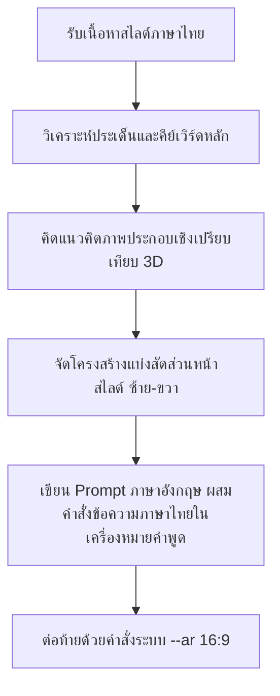

# คู่มือทักษะการออกแบบสไลด์นำเสนอด้วย nanobanana2 (nanobanana-presentation)

ทักษะนี้มีไว้สำหรับควบคุมและสั่งการให้ AI Agent สามารถสร้างและออกแบบคำสั่ง (Prompt) ในการสร้างรูปภาพสำหรับทำสไลด์นำเสนอ (Presentation) ด้วยเทคโนโลยี AI Image Generator โมเดล **nanobanana2** โดยรักษาอัตลักษณ์ความสวยงาม ความชัดเจน และสไตล์การนำเสนอที่เป็นมืออาชีพ

---

## 1. วิสัยทัศน์และข้อกำหนดการออกแบบ (Detailed Design System)

สไลด์นำเสนอที่ผลิตผ่านทักษะนี้จะต้องมอบความรู้สึก **"ทันสมัย เป็นมิตร เข้าถึงง่าย และสบายตา"** เหมาะสำหรับการนำเสนอของครูผู้สอน ผู้ถ่ายทอดความรู้ หรือนักวิชาการที่ต้องการลดระยะทางเทคนิคและมอบประสบการณ์ที่อบอุ่นและมีชีวิตชีวาแก่ผู้เรียน

### 1.1 โทนสีและมิติ (Color Palette & Lighting)
*   **Background (พื้นหลัง):** ใช้สีขาวออฟไวท์ (Clean minimalist off-white, light warm cream, soft pristine white) มีความสว่างใสเป็นธรรมชาติเพื่อช่วยให้อ่านตัวหนังสือได้ง่ายที่สุด
*   **Accent Colors (สีเน้นย้ำ):** จำกัดการใช้สีสดใสจัดจ้าน (เช่น แดงล้วน น้ำเงินล้วน) แต่เน้นสีพาสเทลที่มีมิติ (Warm pastel palette) เช่น สีเขียวมินต์ (mint green), สีส้มอมชมพูอบอุ่น (warm peach), สีฟ้าพาสเทลใส (soft pastel blue) และสีส้มอ่อน (soft orange)
*   **Lighting (สภาพแสง):** แสนอบอุ่นแบบสตูดิโอ (Soft warm ambient glow, gentle volumetric lighting) มีความโปร่งตา ไม่มีเงาดำทะมึน มีเฉพาะเงาตกกระทบแบบนุ่มนวล (Cozy soft drop shadows)
*   **Glassmorphism (ดีไซน์กระจกใส):** การใช้วัสดุการ์ดโปร่งแสง (Translucent glassmorphic card, frosted glass texture) เพื่อสร้างความลึกและมิติให้สไลด์ดูพรีเมียม

### 1.2 รูปแบบและสไตล์คาแรคเตอร์ (Character & Graphics Style)
*   **3D Claymation Style:** ลายเส้นแนวตุ๊กตาดินน้ำมัน 3 มิติขัดเงา มีความโค้งมน ไม่มีมุมแหลมคมที่ดูแข็งทื่อ
*   **Friendly & Approachable:** ตัวละคร (ครู นักเรียน หรือหุ่นยนต์ผู้ช่วย) จะต้องมีใบหน้ายิ้มแย้ม เป็นมิตร มีดวงตากลมโตเป็นมิตร (Friendly smiling face, big expressive eyes)
*   **Cute Visual Metaphors:** การเลือกใช้องค์ประกอบเชิงเปรียบเทียบที่เข้าใจง่ายและน่ารัก เช่น
    *   **ความรู้/ไอเดีย:** ใช้รูปหลอดไฟยิ้มได้ หรือหนังสืออัจฉริยะที่ปล่อยไอคอนเรืองแสง
    *   **การจัดการ/วางแผน:** ใช้รูปกล่องกิจกรรม 3 มิติ หรือกระดานบอร์ดที่มีการปักหมุดกระดาษโน้ตสีสันสดใส
    *   **ระบบเทคโนโลยี:** ใช้รูปหน้าจอคอมพิวเตอร์ที่แสดงส่วนต่อประสานที่เรียบง่ายและเป็นกันเอง พร้อมด้วยหุ่นยนต์ผู้ช่วยตัวจิ๋ว

---

## 2. กฎเหล็กด้านความปลอดภัยของข้อความและการแสดงผล (Strict Formatting Rules)

> [!IMPORTANT]  
> **1. กฎการห้ามใช้คำว่า "16:9" ในเนื้อหาคำอธิบาย (No Literal "16:9" in Prompt Body):**  
> ปัญหาหลักของโมเดล AI ในปัจจุบันคือ เมื่อระบุตัวเลขสัดส่วนลงในข้อความคำอธิบายหลัก เช่น *"a 16:9 presentation slide"* ตัว AI มักจะเขียนตัวหนังสือคำว่า *"16:9"* แปะลงบนเนื้อหาสไลด์โดยตรง ซึ่งเป็นสิ่งที่ไม่ต้องการ  
> **แนวทางแก้ไขที่เป็นรูปธรรม:**  
> *   **ห้ามเขียน:** `16:9 slide`, `16:9 aspect ratio text`, `ratio 16:9` ลงในประโยคพรรณนาภาพประกอบ  
> *   **ให้เขียนแทน:** `widescreen presentation slide`, `widescreen format template`, `widescreen layout`  
> *   **สำหรับควบคุมอัตราส่วนรูปภาพ:** ให้ใส่เฉพาะพารามิเตอร์ระบบต่อท้ายสุดของประโยคเท่านั้น โดยคั่นด้วยเครื่องหมายจุลภาคและเคาะวรรค เช่น `, --ar 16:9`

> [!IMPORTANT]  
> **2. การระบุและควบคุมข้อความภาษาไทย (Thai Text Preservation):**  
> ข้อความภาษาไทยที่จะให้แสดงบนการ์ดหรือแผ่นสไลด์ จะต้องถูกระบุในเครื่องหมายอัญประกาศคู่ `""` เสมอ และควรระบุบทบาทของข้อความนั้นให้ชัดเจน เช่น  
> *   `Features the clear and modern Thai text: "[หัวข้อหลัก]" as the main title`
> *   `and "[รายละเอียด]" as the bullet points/subtitle`
> 
> หากข้อความภาษาไทยยาวเกินไป ให้ย่อเอาเฉพาะ **"คีย์เวิร์ดสำคัญ"** เพื่อป้องกันตัวอักษรซ้อนทับกันหรือไม่สวยงาม

---

## 3. ขั้นตอนการแปลงเนื้อหาดิบเป็น Prompt (The Translation Process)

เมื่อได้รับเนื้อหาภาษาไทยจากเอกสารต้นฉบับ ครู หรือนักเรียน ให้ดำเนินตาม 4 ขั้นตอนดังนี้:



1.  **วิเคราะห์ใจความสำคัญ:** หาหัวข้อหลัก (Title) และประเด็นสำคัญ (Core bullets)
2.  **ออกแบบภาพเชิงเปรียบเทียบ:** เลือกภาพประกอบที่สอดคล้อง (เช่น บทเรียนเศษส่วน -> การหั่นขนมเค้ก 3 มิติที่เป็นมิตร)
3.  **วาง Layout สไลด์:** กำหนดให้ชัดเจนว่าภาพประกอบอยู่ฝั่งไหน (เช่น ซ้าย) และตัวหนังสือภาษาไทยอยู่ฝั่งไหน (เช่น ขวา บนกล่องการ์ดสีขาวสะอาดตา)
4.  **เขียนคัดสรรข้อความ:** แปลงประโยคทั้งหมดเป็นโครงสร้างภาษาอังกฤษที่รัดกุมสำหรับ nanobanana2 พร้อมคงข้อความภาษาไทยที่ต้องการไว้

---

## 4. โครงสร้างคำสั่งมาตรฐาน (Prompt Template Formula)

```text
nanobanana2 style, a professional widescreen presentation slide template, clean minimalist white background. [1. คำอธิบายรายละเอียดภาพประกอบฝั่งซ้ายหรือขวาอย่างเป็นรูปธรรม]. [2. คำอธิบายการแบ่งพื้นที่และการจัดหน้าสไลด์ เช่น "On the right side: a clean white glassmorphic card..."]. Features the clear and modern Thai text: "[หัวข้อสไลด์หลัก]" as the main title, and "[รายละเอียดประเด็นย่อยในรูปแบบรายการหรือข้อความสั้น]" as the subtitle/bullet points. [3. รายละเอียดการคุมโทนสี แสงเงา แสงสตูดิโออุ่นๆ และความรู้สึกที่เป็นมิตรของภาพ], --ar 16:9
```

---

## 5. คลังข้อมูลและคำอธิบายรายละเอียดตัวอย่างของแต่ละ Slide (Slide-by-Slide Reference Catalog)
*ด้านล่างนี้คือรายละเอียดและคำสั่ง Prompt ภาษาอังกฤษที่มีความชัดเจนสูง สำหรับสร้างสื่อสไลด์ชุด "คู่มือการติดตั้งและใช้งาน Agentic AI Workstation" ครบทั้ง 27 หน้า:*

### สไลด์ที่ 1: การประยุกต์ใช้ AI Agent ในการจัดการเรียนการสอน
*   **เป้าหมายเนื้อหา:** แนะนำการประยุกต์ใช้ AI Agent และ Antigravity IDE ในรูปแบบของ Workshop
*   **คำสั่งสร้างภาพ (Prompt):**
    ```text
    nanobanana2 style, a professional widescreen presentation slide with a sleek minimalist layout. Clean off-white background with a subtle, warm ambient glow. On the left side: a beautiful and friendly 3D illustration of a smiling teacher next to a cute, helpful little white robot holding a digital pencil. On the right side: elegant and extremely clear typography in Thai, featuring the bold title "การประยุกต์ใช้ AI Agent ในการจัดการเรียนการสอน" and the subtitle "แนวทางการใช้งาน Antigravity IDE และทักษะเฉพาะด้าน (Skills)". Below, the small text "WORKSHOP: AI AGENT FOR TEACHING & LEARNING" is neatly printed. Cozy soft shadows, premium glassmorphism accents, bright and modern aesthetic, --ar 16:9
    ```

### สไลด์ที่ 2: เป้าหมายการอบรม
*   **เป้าหมายเนื้อหา:** แสดงประเด็นและเป้าหมายการจัดอบรม 4 ข้อ
*   **คำสั่งสร้างภาพ (Prompt):**
    ```text
    nanobanana2 style, a professional widescreen presentation slide template, clean minimalist white space. A structured layout featuring a beautiful diagonal timeline or horizontal roadmap with four main milestones. Each milestone is highlighted by a glowing 3D icon inside a soft glassmorphic card: a cute robot head, a tool toolbox, a modern laptop with a workspace interface, and a teacher creating a webpage. The main title is clearly written in bold Thai text at the top: "เป้าหมายการอบรม", followed by four detailed, beautifully formatted bullet points: "1. เข้าใจบทบาท AI Agent", "2. การใช้ทักษะเฉพาะด้าน (Skill)", "3. ติดตั้ง Antigravity IDE", "4. ปฏิบัติงานจริง". Extremely crisp rendering, elegant modern typography, --ar 16:9
    ```

### สไลด์ที่ 3: ปัญหาในการเตรียมการสอน
*   **เป้าหมายเนื้อหา:** อภิปรายปัญหาและภาระงานครูที่ใช้ดีไซน์/เตรียมสื่อการสอนและเอกสารเยอะ
*   **คำสั่งสร้างภาพ (Prompt):**
    ```text
    nanobanana2 style, a professional widescreen presentation slide template, clean minimalist white theme with soft peach accents. On the left side: a relatable, friendly 3D illustration of a teacher sitting at a modern desk, looking overwhelmed with massive stacks of papers, multiple color palettes, and tiny floating clock icons. On the right side: a clean white text card displaying the bold main title in Thai: "ปัญหาในการเตรียมการสอน" and subtitle "ภาระงานที่พบบ่อยในการเตรียมสื่อและแผนการเรียนรู้", followed clear bullet points: "การออกแบบใช้เวลามาก", "การสร้างสื่อเคลื่อนไหวซับซ้อน", "งานเอกสารปริมาณมาก". Warm comforting lighting, soft shadows, --ar 16:9
    ```

### สไลด์ที่ 4: AI Agent คืออะไร?
*   **เป้าหมายเนื้อหา:** อธิบายคุณลักษณะของระบบ AI ที่วางแผนและทำงานได้ด้วยตนเอง
*   **คำสั่งสร้างภาพ (Prompt):**
    ```text
    nanobanana2 style, a professional widescreen presentation slide with a modern two-column layout. Minimalist white background with soft mint green details. Left column features a friendly and cute 3D rendering of a smart little robot wearing tiny glasses and holding a digital checkboard with a pencil. Right column features the bold Thai title: "AI Agent คืออะไร?" and clear explanation text: "ระบบปัญญาประดิษฐ์ที่ทำงานได้ด้วยตนเองเพื่อบรรลุเป้าหมายที่กำหนด ซึ่งมีความสามารถในการวางแผน จดจำ และเข้าถึงเครื่องมือระบบปฏิบัติการภายนอกเพื่อบรรลุเป้าหมายจริง". Elegant spacing, crisp text, --ar 16:9
    ```

### สไลด์ที่ 5: การเปรียบเทียบ Chatbot กับ AI Agent
*   **เป้าหมายเนื้อหา:** แสดงจุดตัดความต่างระหว่างระบบแชทบอทตอบคำถามเป็นคำๆ กับหุ่นยนต์เอเจนต์ที่ทำงานต่อเนื่อง
*   **คำสั่งสร้างภาพ (Prompt):**
    ```text
    nanobanana2 style, a professional widescreen comparison slide layout, bright minimalist white background. Two clean column cards side-by-side. The left card represents "Chatbot" with a simple cute 2D speech bubble icon and the description: "ตอบคำถามเป็นรายครั้ง". The right card represents "AI Agent" with a friendly 3D robot holding a mini hammer and editing a website code block, with the description: "วางแผนและทำงานแทนได้เอง". Above the cards, the bold Thai title is displayed beautifully: "การเปรียบเทียบ Chatbot กับ AI Agent". Soft gradients, clean modern layout, --ar 16:9
    ```

### สไลด์ที่ 6: 3 ส่วนประกอบหลักของ AI Agent
*   **เป้าหมายเนื้อหา:** สรุป 3 ส่วนประกอบหลัก: Planning, Memory, Tool Use
*   **คำสั่งสร้างภาพ (Prompt):**
    ```text
    nanobanana2 style, a professional widescreen presentation slide template with three clean, rounded columns. Clean off-white background. Each column is topped with a beautiful, glowing transparent glass sphere containing: a colorful brain map (Planning), a happy-faced hard drive (Memory), and a miniature wrench and digital brush (Tool Use). The main title at the top is bold Thai text: "3 ส่วนประกอบหลักของ AI Agent", with subtitle "องค์ประกอบสำคัญในการทำงานของ AI Agent". Below each sphere, the labels are rendered clearly: "1. Planning (การวางแผน)", "2. Memory (ความจำ)", "3. Tool Use (การใช้เครื่องมือ)". Premium design aesthetic, --ar 16:9
    ```

### สไลด์ที่ 7: AI Agent Skill คืออะไร?
*   **เป้าหมายเนื้อหา:** อธิบายเรื่องคู่มือปฏิบัติงานเฉพาะด้านที่ติดตั้งให้ AI Agent นำไปทำตามข้อกำหนด
*   **คำสั่งสร้างภาพ (Prompt):**
    ```text
    nanobanana2 style, a professional widescreen presentation slide. Clean minimalist white space with cozy warm lighting. On the left side: a beautiful 3D open book illustration titled "AI Agent Skill Guide" with tiny, colorful glowing icons of folders, a graduation cap, and a paintbrush floating above the pages. On the right side: a neat card displaying the bold Thai title: "AI Agent Skill คืออะไร?" and description: "คู่มือและกรอบข้อมูลสำหรับควบคุมการทำงานของ AI Agent ในการกำหนดกรอบข้อบังคับ สไตล์ และผลลัพธ์ของชิ้นงาน". Modern Thai typography, --ar 16:9
    ```

### สไลด์ที่ 8: ทำไมต้องให้ AI ทำงานผ่าน Skill?
*   **เป้าหมายเนื้อหา:** ชี้แจงคุณสมบัติและประโยชน์ของการควบคุมด้วยทักษะ (Skill) ทั้งในแง่ดีไซน์และความถูกต้องวิชาการ
*   **คำสั่งสร้างภาพ (Prompt):**
    ```text
    nanobanana2 style, a professional widescreen presentation slide. Clean minimalist white background with soft sky-blue borders. A friendly and cute 3D robot character walking happily along a clear, glowing path lined with colorful indicator flags representing safety constraints. In the text area, the bold Thai title is displayed: "ทำไมต้องให้ AI ทำงานผ่าน Skill?", with a clean bulleted list explaining: "1. ควบคุมความถูกต้อง (ป้องการข้อมูลคลาดเคลื่อน)", "2. ควบคุมงานดีไซน์ (กำหนดฟอนต์และสีสัน)", "3. ประหยัดเวลาทำงาน (ดึงตัวอย่างและโค้ดเก่าที่มีอยู่แล้ว)", Superb details, --ar 16:9
    ```

### สไลด์ที่ 9: ยุค Agentic Coding
*   **เป้าหมายเนื้อหา:** แสดงการเปลี่ยนผ่านการทำโค้ดสู่การเป็น System Orchestrator ของผู้ใช้
*   **คำสั่งสร้างภาพ (Prompt):**
    ```text
    nanobanana2 style, a professional widescreen presentation slide. Clean off-white background, cozy and modern tech workstation feel. A friendly developer sitting at a desk with green potted plants, looking happily at a large digital screen where a cute helper robot is writing code lines. The main title is clearly rendered in bold Thai text: "ยุค Agentic Coding", with the subtitle: "แนวโน้มการพัฒนาซอฟต์แวร์ร่วมกับเทคโนโลยี AI Agent โดยปรับบทบาทจากผู้ควบคุมทิศทางและผู้ควบคุม". Elegant layout, clean typography, --ar 16:9
    ```

### สไลด์ที่ 10: คุณสมบัติของ Antigravity IDE
*   **เป้าหมายเนื้อหา:** ชูประเด็นเด่นเรื่อง Terminal Sandbox, Permissions System, Integrated Workspace
*   **คำสั่งสร้างภาพ (Prompt):**
    ```text
    nanobanana2 style, a professional widescreen presentation slide showing a sleek and modern IDE dashboard UI. The layout is mostly clean white and soft grey with a friendly tech theme. Features three clearly defined boxes on the screen: a safe glowing glass dome labeled "Terminal Sandbox", a cute smiling golden padlock labeled "Permissions System", and a split-pane layout labeled "Integrated Workspace". The bold Thai title at the top reads: "คุณสมบัติของ Antigravity IDE". Very neat and detailed UI elements, --ar 16:9
    ```

### สไลด์ที่ 11: ขั้นตอนการติดตั้ง Antigravity IDE
*   **เป้าหมายเนื้อหา:** นำเสนอ 4 ขั้นตอนการติดตั้งและเซ็ตอัปอย่างเป็นทางการ
*   **คำสั่งสร้างภาพ (Prompt):**
    ```text
    nanobanana2 style, a professional widescreen presentation slide. Clean minimalist white background with soft warm shadows. A beautifully designed 4-step flowchart showing a cute box package being downloaded, placed onto a sleek laptop, a green checkmark button clicked, and a program launching with small colorful stars. The bold Thai title: "ขั้นตอนการติดตั้ง Antigravity IDE" is rendered at the top, and each step has a clean label: "1. ดาวน์โหลด", "2. ติดตั้งโปรแกรม", "3. ตั้งค่าระบบ", "4. ตรวจสอบความพร้อม". Perfect clarity, --ar 16:9
    ```

### สไลด์ที่ 12: การติดตั้งอย่างง่ายสำหรับครู
*   **เป้าหมายเนื้อหา:** แผนผังย่อ 3 ขั้นตอนเข้าใจง่ายสำหรับผู้สอนที่ไม่ถนัดเทคโนโลยีเชิงลึก
*   **คำสั่งสร้างภาพ (Prompt):**
    ```text
    nanobanana2 style, a professional widescreen presentation slide designed specifically for teachers. Bright minimalist white theme. A very clean and cute 3-step vertical or horizontal visual list. Each step is represented by a friendly, colorful cartoon circle: a downward-pointing arrow (ดาวน์โหลดไฟล์), a modern application icon (ติดตั้งแอปพลิเคชัน), and a teacher pointing to a cozy yellow workspace folder (เลือกโฟลเดอร์ทำงาน). Bold Thai title: "การติดตั้งอย่างง่ายสำหรับครู". Cute graphic elements, --ar 16:9
    ```

### สไลด์ที่ 13: การแก้ไขปัญหาการติดตั้ง
*   **เป้าหมายเนื้อหา:** วิธีข้ามกำแพง Security (Windows / macOS) และแก้ไขอาการค้างหน้าจอขาว
*   **คำสั่งสร้างภาพ (Prompt):**
    ```text
    nanobanana2 style, a professional widescreen presentation slide showing troubleshooting tips. A clean white background. A cute helper robot holding a giant glowing magnifying glass to inspect a modern laptop screen showing a happy, green checkmark. On the right side, a clean grey card displays the bold Thai title: "การแก้ไขปัญหาการติดตั้ง" and subtitle: "วิธีแก้ไขอาการติดขัดเบื้องต้น", with bullet points: "กรณีถูกบล็อกโดยระบบรักษาความปลอดภัย", "กรณีโปรแกรมค้างหน้าจอสีขาว". Comforting soft colors, --ar 16:9
    ```

### สไลด์ที่ 14: วิธีติดตั้งทักษะ (Skill) เพิ่มเติม
*   **เป้าหมายเนื้อหา:** การสอนดาวน์โหลดและติดตั้งทักษะการทำสไลด์ให้หุ่นยนต์ AI รู้จักดีไซน์
*   **คำสั่งสร้างภาพ (Prompt):**
    ```text
    nanobanana2 style, a professional widescreen presentation slide, clean minimalist white space. A friendly 3D illustration of a user placing a bright, glowing "Frontend-Slides" puzzle piece into a cute robot's back panel. On the right side: a clean white text container with the bold Thai title: "วิธีติดตั้งทักษะ (Skill) เพิ่มเติม" and description: "การแนบคู่มือเฉพาะด้านเพื่อให้ AI Agent รองรับงานรูปแบบใหม่". Elegant modern Thai typography, --ar 16:9
    ```

### สไลด์ที่ 15: วิธีที่ 1: ติดตั้งทักษะผ่านช่องแชต (วิธีแนะนำ)
*   **เป้าหมายเนื้อหา:** แนะนำการพิมพ์แชทคำสั่งส่งลิงก์ Git เพื่อให้หุ่นยนต์ลงของให้เรียบร้อย
*   **คำสั่งสร้างภาพ (Prompt):**
    ```text
    nanobanana2 style, a professional widescreen presentation slide. A clean minimalist laptop interface showing a friendly chat window. A user's speech bubble containing: "ช่วยติดตั้งทักษะ frontend-slides ให้หน่อย" and a cute robot avatar responding with a happy thumbs-up bubble and a progress bar. Bold Thai title at the top: "วิธีที่ 1: ติดตั้งทักษะผ่านช่องแชต (วิธีแนะนำ)". Soft shadows, extremely clean UI design, --ar 16:9
    ```

### สไลด์ที่ 16: วิธีที่ 2: ติดตั้งทักษะผ่านแถบคำสั่งแชตของระบบ
*   **เป้าหมายเนื้อหา:** การโคลนด้วยคำสั่งในแถบพิมพ์คำสั่ง Workspace IDE
*   **คำสั่งสร้างภาพ (Prompt):**
    ```text
    nanobanana2 style, a professional widescreen presentation slide. A friendly developer terminal interface showing a clean Git cloning command: `https://github.com/.../frontend-slides.git`. Next to the screen, a cute little robot helper holds a green glowing ethernet plug and smiles. The main title is bold Thai text: "วิธีที่ 2: ติดตั้งทักษะผ่านแถบคำสั่งแชตของระบบ". Minimalist clean light-themed UI, --ar 16:9
    ```

### สไลด์ที่ 17: ขีดความสามารถของทักษะ Frontend-Slides
*   **เป้าหมายเนื้อหา:** แสดงการรองรับอัตราส่วนภาพแบบตอบสนอง แสดงตัวหนังสือสวย และออกไฟล์ HTML ดึงไปเปิดออฟไลน์ได้
*   **คำสั่งสร้างภาพ (Prompt):**
    ```text
    nanobanana2 style, a professional widescreen presentation slide. A modern showcase showing a mock presentation slide beautifully and responsively adapted onto three mockups: a laptop, a tablet, and a smartphone. The background is clean minimalist white. The main title is bold Thai text: "ขีดความสามารถของทักษะ Frontend-Slides", and features are listed below: "อัตราส่วนหน้าจอแบบกว้างพิเศษ", "เอฟเฟกต์แสดงข้อความ", "ไฟล์เดี่ยวแบบออฟไลน์". Premium modern look, --ar 16:9
    ```

### สไลด์ที่ 18: ทักษะการออกแบบหลักสูตร OBE
*   **เป้าหมายเนื้อหา:** การวิเคราะห์แผนการเชื่อมโยง CLO-PLO และจัดร่าง มคอ.3 (OBE3)
*   **คำสั่งสร้างภาพ (Prompt):**
    ```text
    nanobanana2 style, a professional widescreen presentation slide. Clean minimalist white board layout. A friendly teacher in a professional suit and a cute assistant robot pointing at a beautifully structured curriculum flowchart showing "CLO to PLO alignment". The main title is bold Thai text: "ทักษะการออกแบบหลักสูตร OBE" with key labels: "จัดโครงสร้างเนื้อหาวิชา", "วิเคราะห์แผนการเชื่อมโยง", "ร่างเอกสารประเมินผล OBE3". Crisp diagram, --ar 16:9
    ```

### สไลด์ที่ 19: ทักษะการเขียนตำราวิชาการ
*   **เป้าหมายเนื้อหา:** จัดแต่งสมการคณิตศาสตร์ ฟิสิกส์ ข้อสอบพร้อมเฉลยอย่างถูกต้องเหมาะสม
*   **คำสั่งสร้างภาพ (Prompt):**
    ```text
    nanobanana2 style, a professional widescreen presentation slide with a cozy academic theme. A clean white study desk showing an open textbook containing neat, elegant math equations, formulas, and diagrams. Next to it is a wooden pen holder and a friendly little glowing lightbulb character. The main title is bold Thai text: "ทักษะการเขียนตำราวิชาการ" with bullet points: "จัดรูปแบบสมการและโค้ด", "ผลิตข้อสอบและวิธีทำ", "รักษามาตรฐานงานเขียน". Cozy light, --ar 16:9
    ```

### สไลด์ที่ 20: ทักษะการออกแบบ UI/UX สำหรับเว็บแอป
*   **เป้าหมายเนื้อหา:** แนะนำการวาง Grid ระยะโครงสร้าง ความโปร่งใสของสี HSL การถนอมสายตา และการป้อนลูกเล่นโต้ตอบ
*   **คำสั่งสร้างภาพ (Prompt):**
    ```text
    nanobanana2 style, a professional widescreen presentation slide showing UI/UX design tokens. Clean white and glassmorphic aesthetic. Displays a modern web page mockup interface on a drafting table, surrounded by beautiful HSL color swatches and a floating mouse cursor. The main title is bold Thai text: "ทักษะการออกแบบ UI/UX สำหรับเว็บแอป" with design points: "เลือกชุดสีและมิติ", "ออกแบบส่วนวางโครงสร้าง", "แนะนำลูกเล่นการตอบสนอง". Clean and bright, --ar 16:9
    ```

### สไลด์ที่ 21: ทักษะการตรวจเกลางานวิจัยและวิชาการ
*   **เป้าหมายเนื้อหา:** ปรับปรุงบทคัดย่อ ปลุกน้ำเสียงเขียนวิชาการให้เป็นธรรมชาติ ถูกต้องและดูมีน้ำหนักทางการวิจัย
*   **คำสั่งสร้างภาพ (Prompt):**
    ```text
    nanobanana2 style, a professional widescreen presentation slide. A clean white study desk. A friendly hand is using a digital pen to edit and refine a paragraph of text on a modern tablet screen. The redundant words are magically vanishing into tiny golden sparkles, leaving behind a polished, academic English sentence. Bold Thai title: "ทักษะการตรวจเกลางานวิจัยและวิชาการ" with labels: "เกลาคำศัพท์เฉพาะทาง", "ปรับปรุงไวยากรณ์สากล", "ควบคุมการสื่อน้ำเสียง". --ar 16:9
    ```

### สไลด์ที่ 22: โครงสร้างการเขียน Prompt สำหรับครู
*   **เป้าหมายเนื้อหา:** แนะนำแกนสำคัญ 3 ส่วน: บทบาท/วิชาที่สอน + เป้าหมายเนื้อหา + สไตล์การจัดหน้าและดีไซน์
*   **คำสั่งสร้างภาพ (Prompt):**
    ```text
    nanobanana2 style, a professional widescreen presentation slide with a cute visual metaphor. Displays a clean white kitchen counter where three colorful ingredient jars are being mixed in a bowl: a teacher's hat icon (Role), a science book icon (Goal), and a modern Swiss flag grid layout icon (Style). The main title is bold Thai text: "โครงสร้างการเขียน Prompt สำหรับครู" with formula text below: "บทบาทและวิชาที่สอน + เป้าหมายเนื้อหา + สไตล์การจัดหน้าและดีไซน์". Cute 3D rendering, --ar 16:9
    ```

### สไลด์ที่ 23: กิจกรรมเชิงปฏิบัติการ: สร้างสไลด์การสอนใน 5 นาที
*   **เป้าหมายเนื้อหา:** กิจกรรมทำจริงในคาบเรียน โครงร่างดิบ -> ป้อนคำสั่ง -> ชมดีไซน์ 3 แบบ
*   **คำสั่งสร้างภาพ (Prompt):**
    ```text
    nanobanana2 style, a professional widescreen presentation slide for a workshop. Clean minimalist off-white background with a cozy coffee shop theme. Displays a laptop screen showing a multi-slide presentation, next to a cute desk clock showing "5 mins". The main title is bold Thai text: "กิจกรรมเชิงปฏิบัติการ: สร้างสไลด์การสอนใน 5 นาที" with steps: "1. จัดเตรียมเนื้อหาดิบ", "2. ป้อนข้อความคำสั่ง", "3. เลือกสไตล์ดีไซน์". Friendly and bright, --ar 16:9
    ```

### สไลด์ที่ 24: การแก้ไขเนื้อหาโดยตรงบนเบราว์เซอร์
*   **เป้าหมายเนื้อหา:** สาธิตปุ่มลัดพิมพ์แก้คำผิดบนหน้าเบราว์เซอร์ได้ทันที ดับเบิลคลิก หรือกด E
*   **คำสั่งสร้างภาพ (Prompt):**
    ```text
    nanobanana2 style, a professional widescreen presentation slide showing an active browser page. Inside the browser, a title block has a red dotted border indicating edit mode, where a cute little cartoon pencil character is typing text directly. A hand is pressing the "E" key on a keyboard. The main title is bold Thai text: "การแก้ไขเนื้อหาโดยตรงบนเบราว์เซอร์" with bullet points: "ดับเบิลคลิกมุมขวาบนสุด", "กดปุ่ม E หรือ ดับเบิลคลิก", "กดบันทึกหรือล็อคปุ่ม E อีกครั้ง". --ar 16:9
    ```

### สไลด์ที่ 25: ข้อเสนอแนะเพื่อคุณภาพสื่อการสอน
*   **เป้าหมายเนื้อหา:** เกร็ดความรู้เรื่องการตัดสี การจำกัดภาพเคลื่อนไหว ป้องกันลายสายตาผู้เรียน และการดึงข้อมูล HTML มาใช้
*   **คำสั่งสร้างภาพ (Prompt):**
    ```text
    nanobanana2 style, a professional widescreen presentation slide with three cute rectangular note cards pinned onto a clean white corkboard. The cards display: high-contrast color swatches (Contrast), a clean slide with simple animations (Focus), and a big green download button (Download HTML). The main title is bold Thai text: "ข้อเสนอแนะเพื่อคุณภาพสื่อการสอน" with detailed pointers below each card. Bright and friendly classroom vibes, --ar 16:9
    ```

### สไลด์ที่ 26: Vercel คืออะไร และการ Deploy ขึ้น Server
*   **เป้าหมายเนื้อหา:** บริการคลาวด์ฝากสไลด์ในคลิกเดียว เข้าชมได้จากลิงก์สาธารณะโดยไม่ต้องติดตั้งโปรแกรมดู
*   **คำสั่งสร้างภาพ (Prompt):**
    ```text
    nanobanana2 style, a professional widescreen presentation slide showing cloud deployment. A happy, cute little red and white rocket ship blasting off from a modern laptop, carrying a presentation web page towards a smiling white cloud labeled "Vercel". Below, a smiling teacher is cheering. Bold Thai title: "Vercel คืออะไร และการ Deploy ขึ้น Server" with descriptions: "ทำไมครูต้อง Deploy", "วิธีขึ้นออนไลน์ง่ายๆ", "แชร์ลิงก์สาธารณะ". --ar 16:9
    ```

### สไลด์ที่ 27: สรุปหัวใจสำคัญและถาม-ตอบ (Q&A)
*   **เป้าหมายเนื้อหา:** สรุปการประสานกันของ AI Agent + Antigravity IDE + Skills และช่วงเวลาตอบคำถาม
*   **คำสั่งสร้างภาพ (Prompt):**
    ```text
    nanobanana2 style, a professional widescreen presentation slide for the final Q&A. A cozy modern classroom with warm sun rays beaming in. A smiling teacher and a cute little robot are standing side-by-side, waving happily to the audience. Neat speech bubbles containing question marks and happy face icons float above them. Main title is bold Thai text: "สรุปหัวใจสำคัญและถาม-ตอบ (Q&A)". Beautifully framed, --ar 16:9
    ```
